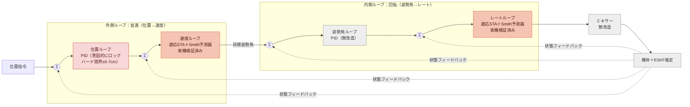
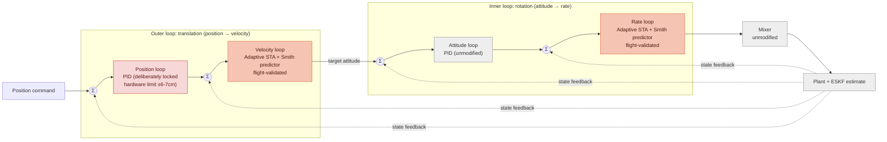

# StampFly Ecosystem — smc_rate_asta（適応STA）ミキサー検証記録

> **Note:** [English version follows after the Japanese section.](#english) / 日本語の後に英語版があります。

## 本件について

本ドキュメントは、`stampfly_ecosystem`（[M5Fly-kanazawa/stampfly_ecosystem](https://github.com/M5Fly-kanazawa/stampfly_ecosystem)からfork）上で行った、
**適応スーパーツイスティングアルゴリズム（Adaptive Super-Twisting Algorithm, ASMC）レートループ制御器
`smc_rate_asta` の検証・実機投入作業**の記録です。詳細な技術的経緯・数値データ・文献根拠は
[`docs/plans/smc-rate-loop-plan.md`](docs/plans/smc-rate-loop-plan.md)（§7.31〜§7.40）に一次記録があり、
本ドキュメントはその要約です。

## 背景

`smc_rate_asta` は、固定ゲインのSTA（`smc_rate_sta`、実機投入済み・凍結版）に対し、規範モデル＋二重EMA
トレンド判定による適応ゲイン機構を追加した実験用アプリです（`firmware/apps/smc_rate_asta/`）。5シナリオ
回帰でほぼ全ゲートをクリアしたものの、最も過酷な条件（`pos_flight+motor-delay=15ms`、ロール+ピッチ同時
ステップ機動）で `duty_max=0.9691`（ゲート`<0.9`にわずかに届かず）が残存していました。

## 行った検討・結論

| 節 | 内容 | 結果 |
|---|---|---|
| §7.38 | duty_max飽和の原因を再検証（`sf log convert --aligned`による確定データ） | 従来の「ヨートルク不足」説は誤診断（陳腐化したtrajectory.csvが原因）と判明。実際はロール+ピッチ差動トルクの同一モータへの瞬間的な重なりが原因 |
| §7.38 | k1スルーレート制限の試行 | 逆効果（duty_max 0.9691→0.9805）、否定的結果として記録 |
| §7.39 | ミキサー側「余裕を考慮した比例デサチュレーション」の試行（`actuator.cpp`、全アプリ共有） | duty_maxはわずかしか改善せず（0.9691→0.9593）、tilt_maxに新規退行（15.10°→19.31°）。差し戻し、否定的結果として記録 |
| §7.40 | 根本原因の確定 | `pos_flight.scn`自身の既存コメント（2026-07-26、`smc_rate_asta`着手前）により、base duty（約0.745）に対しロール+ピッチ同時要求（単独軸の約√2倍）の**差動余白が構造的に不足**——分配の歪みでなく容量不足と確定。redistribution系の対処（§7.38/§7.39）はいずれも決定打たり得ないことも判明 |
| — | ゲート方針 | `pos_flight.expect`の`duty_max`ゲートを`<0.90`→`<0.99`に変更（既知の限界を反映、値自体は緩めるが「未達を隠さない」xfailマーカーは維持）。案3「現状を受容する」を正式採用 |
| — | ミキサー仕様書の整備 | `firmware/vehicle/docs/detailed_design.md`に新規§10（JP）/§9（EN）「Actuation (Mixer) Interface Definition」を追加——従来`actuator.cpp`の`@design`タグが指していた参照先が実在しない節（無関係なESKF節）を指す誤りだったのも修正 |

## 実機投入

上記の検証を経て、`smc_rate_asta`を実機StampFlyへ初めて書き込みました（`sf app flash smc_rate_asta`）。
比較対照として既定PID（`vehicle`ターゲット）も書き込み・検証しています。

### フリーフライト結果

- 操作感度は良好
- **無操作時にたまにZ軸（ヨー）回転が発生する現象を観測**——既定PIDでも同様に発生することを確認
  - 両アプリで共通して発生することから、**レートループの制御則自体（STA vs PID）が原因である可能性は低い**
  - 両アプリが共有する経路（ヘディングホールド機構`attitude.yawhold`、ESKFのヨー推定——`eskf.use_mag=0`のためジャイロ積分のみで絶対方位基準がない、モータ/プロペラの個体差によるヨートルク偏り等）に原因がある可能性を検討中
  - 未解決・調査継続中の項目

## 制御構造（smc_pos_asta、水平チャンネル）— 2026-09-14改訂

`smc_pos_asta`（位置/速度ループも適応STA化した拡張版アプリ、§7.54系列で実機投入）の水平（x, y）
チャンネルは、位置→速度→姿勢角→レートの4段カスケードのうち**速度ループとレートループだけ**が
適応STA＋Smith予測器に置き換わっている。位置ループ・姿勢角ループ・ミキサー・機体/ESKF状態推定は
無改造のPIDのまま。高度（z）チャンネルはこの図に含まれない——構造的に並行するPIDループだが、
SMC化の対象外（`altitude.vel.kp`のゲイン再調整のみ、§7.54続報9）。

**この図は「無改造」を一枚岩に扱わない**——位置ループは他の無改造ブロック（姿勢角・ミキサー）とは
性質が異なる。姿勢角・ミキサーは「まだ手を付けていないだけ」だが、**位置ループは意図的にロック
されている**: 2026-06-22の実機初飛行で成長する不安定振動→壁激突を起こし、原因はモータ/プロペラの
トルク効き不足（実測0.4〜0.7倍）という**ハードウェア限界**と実機同定で確定済み（
[`firmware/vehicle/docs/poshold_journey.md`](firmware/vehicle/docs/poshold_journey.md) §4）。
2026-09-14に改めてこの位置ループのゲインを探索したが（[`smc-rate-loop-plan.md`](docs/plans/smc-rate-loop-plan.md)
§7.55）、当時実機を発散させた`kp=1.0`と同じ危険域を再発見しただけに終わり、**このハード限界を
超える改善策は現時点で存在しない**——`±6〜7cm`が本機体のPOS_HOLD精度の実用上限。

凡例: 灰＝無改造PID（既知の課題なし）／**赤＝無改造PID（意図的にロック、ハード限界につき変更禁止）**／
橙＝適応STA＋Smith予測器（実機検証済み）。

**実機検証状況（速度/レートループ、橙）**: Smith予測器の実測遅延ベースパラメータ
（`predictor_tau_m`: roll 0.062・pitch 0.061・yaw 0.13・velx/vely 0.06）を投入した状態で、
実機テレメトリにより**3回・計139秒の健全な飛行**（tilt_max 11〜13°、離着陸時の接地事故2件は
制御則と無関係と切り分け済み）を確認済み（§7.54続報13）。ただし`smc_pos_asta`自体は依然
**実験的なapp**であり、デフォルトの本番コントローラは既定PID（`vehicle`ターゲット）のまま
——速度/レートループへのSTA化は「有望で実証済みの選択肢」だが「標準採用」の決定はまだしていない。

Smith予測器（コーラル色の2ブロック内部）は、各軸自身の前サイクル指令を1次遅れモデルに通して
「まだ測定値に現れていない分」を予測し、前方積分してリーキーウォッシュアウトを掛けたうえで
測定値に加算してからスライディング面を計算する——実測アクチュエータ遅延（約60ms）を、到達則
ゲインを下げずに補償する（詳細は[`docs/plans/smc-rate-loop-plan.md`](docs/plans/smc-rate-loop-plan.md)
§7.54続報4/7-10、実装は
[`adaptive_sliding_mode_sta.hpp`](firmware/apps/smc_pos_asta/adaptive_sliding_mode_sta.hpp)）。

**なぜこの構成が「提案」なのか（速度/レート＝置き換え、位置=ロック、姿勢角/ミキサー=無改造のまま）**:
本計画全体を通じて確立した経験則は、「制御則を精緻化すればするほど頑健になる」わけではなく、
**遅延・ゲイン権限不足という物理的な制約を明示的にモデル化して補償した箇所だけが実際に改善する**、
というもの（[`smc-rate-loop-plan.md`](docs/plans/smc-rate-loop-plan.md)の現状サマリ#4参照）。
速度/レートループはアクチュエータ遅延（約60ms）という明確な遅延要因があり、Smith予測器での
補償が数値的にもテレメトリ的にも効果を示した。位置ループの限界はゲインでなくモータ/プロペラの
物理的なトルク不足であり、制御則側でこれ以上手を出す根拠がない——姿勢角・ミキサーは、今のところ
このような明確な物理的制約の証拠が見つかっていない層であり、優先度の高い次の投資先ではない。

## 関連ドキュメント

| ドキュメント | 内容 |
|---|---|
| [`docs/plans/smc-rate-loop-plan.md`](docs/plans/smc-rate-loop-plan.md) §7.31-7.40 | 本件の一次技術記録（設計根拠・SILS検証データ・否定的結果を含む全経緯） |
| [`firmware/vehicle/docs/detailed_design.md`](firmware/vehicle/docs/detailed_design.md) §10/§9 | ミキサー（配分＋モータ曲線）の詳細仕様 |
| [`firmware/vehicle/docs/architecture.md`](firmware/vehicle/docs/architecture.md) | アーキテクチャ不変条件（INV）・ミキサー差し替え口の設計提案 |
| [`firmware/apps/smc_rate_asta/`](firmware/apps/smc_rate_asta/) | `smc_rate_asta`アプリのソース一式 |

## 参考文献

`docs/plans/smc-rate-loop-plan.md`の制御則設計全体（§2〜§7.54）が依拠した文献の一覧です
（本README冒頭の§7.31-7.40のみでなく、同計画書全体で引用されている文献を収録）。
ID（R1〜R11）は計画書内の引用番号と対応します。

| ID | 文献 | 計画書での使用箇所 |
|----|------|-------------------|
| R1 | W. Gao and J. C. Hung, "Variable structure control of nonlinear systems: a new approach," *IEEE Transactions on Industrial Electronics*, vol. 40, no. 1, pp. 45–55, 1993. | §2.2 到達則（constant-plus-proportional rate reaching law）の根拠 |
| R2 | J.-J. E. Slotine and W. Li, *Applied Nonlinear Control*, Prentice Hall, 1991. | 境界層（`sign()`→`sat()`置換）によるチャタリング抑制・超平面設計の教科書的典拠 |
| R3 | V. Utkin and J. Shi, "Integral sliding mode in systems operating under uncertainty conditions," in *Proc. 35th IEEE Conference on Decision and Control (CDC)*, Kobe, Japan, 1996, pp. 4591–4596. | §3.4 積分項付加（PI型スライディング面）の着想元 |
| R4 | O. J. M. Smith, "Closer control of loops with dead time," *Chemical Engineering Progress*, vol. 53, pp. 217–219, 1957. | §7.7 レートループへの無駄時間予測補償器（Smith予測器）の原典 |
| R5 | A. Levant, "Sliding order and sliding accuracy in sliding mode control," *International Journal of Control*, vol. 58, no. 6, pp. 1247–1263, 1993. | §7.11 スーパーツイスティング法（STA）導入の根拠 |
| R6 | J. A. Moreno and M. Osorio, "Strict Lyapunov functions for the super-twisting algorithm," *IEEE Transactions on Automatic Control*, vol. 57, no. 4, pp. 1035–1040, 2012. | STAの実用的ゲインチューニング条件 |
| R7 | F. Plestan, Y. Shtessel, V. Bregeault, and A. Poznyak, "New methodologies for adaptive sliding mode control," *International Journal of Control*, vol. 83, no. 9, pp. 1907–1919, 2010. | §7.31 適応則（増加/減少の二値則）の根拠 |
| R8 | Y. Shtessel, M. Taleb, and F. Plestan, "A novel adaptive-gain supertwisting sliding mode controller: Methodology and application," *Automatica*, vol. 48, no. 5, pp. 759–769, 2012. DOI: 10.1016/j.automatica.2012.02.024. | STA自身への適応ゲイン付与という設計思想の系譜 |
| R9 | Y. Wang, W. Zhang, Y. Yang, C. Xue, S. Yuan, and H. Zhang, "Adaptive Second-Order Sliding Mode Control of Buck Converters with Multi-Disturbances," *Energies*, vol. 15, no. 14, p. 5139, 2022. DOI: 10.3390/en15145139. | §7.32 スライディング面ゼロクロス計数による適応ゲインの応用元 |
| R10 | "New methodology for adaptive sliding mode control with self-tuning threshold based on chattering detection," *Mechanical Systems and Signal Processing*, 2025（著者名は検索で確認できず書誌情報のみ引用。DOI経由: [ScienceDirect](https://www.sciencedirect.com/science/article/abs/pii/S0888327025005552)）。 | 発振検出そのものに駆動される適応則という考え方の参考先 |
| R11 | W. Barreto da Silveira, P. J. D. de Oliveira Evald, G. V. Hollweg, D. M. C. Milbradt, R. V. Tambara, and H. A. Gründling, "Robust Model Reference Adaptive Control With a Full Adaptive Super-Twisting Sliding Mode Action: Discrete-Time Stability Analysis and Application," *International Journal of Adaptive Control and Signal Processing*, Wiley, 2025. DOI: 10.1002/acs.4101. | §7.33 規範モデル方式への転換の設計根拠 |
| — | Zhang, Fridman et al., "Robust super-twisting sliding mode control of input-delayed nonlinear systems using disturbance observers and predictor feedback." ([ResearchGate](https://www.researchgate.net/publication/384247851_Robust_super-twisting_sliding_mode_control_of_input-delayed_nonlinear_systems_using_disturbance_observers_and_predictor_feedback)) | §7.54続報7: むだ時間系STAへの予測器フィードバックの一般的な枠組み（`smc_pos_asta`のSmith予測器設計） |
| — | "Design of super-twisting control gains: A describing function based methodology," *Automatica*. ([ScienceDirect](https://www.sciencedirect.com/science/article/abs/pii/S0005109818304977)) | §7.54続報7: 記述関数法によるSTA自励振動の理論的分析——同節の理論的支柱 |
| — | "Optimal super-twisting algorithm with time delay estimation for robot manipulators based on feedback linearization," *Mechatronics*. ([ScienceDirect](https://www.sciencedirect.com/science/article/abs/pii/S0921889017304803)) | §7.54続報7: むだ時間推定とSTAの組合せ |

## 元プロジェクトについて

本リポジトリは教育・研究用ドローン制御プラットフォーム
[StampFly Ecosystem](https://github.com/M5Fly-kanazawa/stampfly_ecosystem)のforkです。
インストール手順・全体機能説明は元リポジトリのREADMEを参照してください。

---

## About This Record

This document records the verification and real-hardware deployment work done on the **adaptive
super-twisting (ASMC) rate-loop controller `smc_rate_asta`**, performed in this fork of
[`stampfly_ecosystem`](https://github.com/M5Fly-kanazawa/stampfly_ecosystem). The primary technical
record — full derivations, SILS numbers, and literature references — lives in
[`docs/plans/smc-rate-loop-plan.md`](docs/plans/smc-rate-loop-plan.md) (§7.31-§7.40); this document is
a summary.

## Background

`smc_rate_asta` adds a reference-model + double-EMA trend-based adaptive gain mechanism on top of the
fixed-gain STA (`smc_rate_sta`, already deployed and frozen). It cleared nearly every gate across a
5-scenario regression, but the most adversarial condition (`pos_flight+motor-delay=15ms`, a combined
roll+pitch step maneuver) left a residual `duty_max=0.9691` (just short of the `<0.9` gate).

## Investigation and Conclusion

| Section | Summary | Result |
|---|---|---|
| §7.38 | Re-diagnosed the duty saturation root cause using verified data (`sf log convert --aligned`) | The earlier "insufficient yaw torque authority" diagnosis was wrong (based on a stale trajectory.csv); the real cause is a momentary constructive overlap of roll+pitch differential torque on one motor corner |
| §7.38 | Tried a k1 slew-rate limiter | Counterproductive (duty_max 0.9691→0.9805), recorded as a negative result |
| §7.39 | Tried a mixer-level headroom-aware proportional desaturation (`actuator.cpp`, shared by all apps) | duty_max barely improved (0.9691→0.9593) while tilt_max regressed (15.10°→19.31°, a new gate failure); reverted, recorded as a negative result |
| §7.40 | Confirmed the root cause | `pos_flight.scn`'s own pre-existing comment (written 2026-07-26, before `smc_rate_asta` existed) shows the differential-torque headroom above the ~0.745 base duty is **structurally insufficient** for the combined roll+pitch demand (~sqrt(2)x single-axis) — a genuine capacity deficit, not a redistribution-fixable artifact. Neither §7.38 nor §7.39 could have been a decisive fix |
| — | Gate policy | Relaxed `pos_flight.expect`'s `duty_max` gate from `<0.90` to `<0.99` (reflecting the known limit; the "don't hide the shortfall" xfail marker stays). Formally adopted "accept the current gap" as the decision |
| — | Mixer spec documentation | Added a new §10 (JP) / §9 (EN) "Actuation (Mixer) Interface Definition" to `firmware/vehicle/docs/detailed_design.md` — also fixed a stale `@design` tag in `actuator.cpp` that had pointed at an unrelated section |

## Hardware Deployment

Following this verification, `smc_rate_asta` was flashed to a real StampFly for the first time
(`sf app flash smc_rate_asta`). The default PID (`vehicle` target) was also flashed for comparison.

### Free-Flight Result

- Control feel/responsiveness was good
- **Occasional unprompted Z-axis (yaw) rotation was observed with no stick input** — also observed on
  the default PID controller
  - Since both apps show it, the rate-loop control law itself (STA vs. PID) is unlikely to be the cause
  - Suspected shared-path causes under investigation: the heading-hold mechanism
    (`attitude.yawhold`), the ESKF's yaw estimate (no magnetometer — `eskf.use_mag=0` — so yaw comes
    from pure gyro integration with no absolute heading reference), or a per-unit motor/propeller yaw
    torque imbalance
  - Unresolved, investigation ongoing

## Control Structure (smc_pos_asta, horizontal channel) — revised 2026-09-14

In `smc_pos_asta` (the extended app that also puts the velocity/position loops on adaptive STA,
deployed to real hardware in the §7.54 series), the horizontal (x, y) channel's 4-stage cascade
(position → velocity → attitude → rate) has had **only the velocity loop and the rate loop**
replaced with adaptive STA + Smith predictor. The position loop, attitude loop, mixer, and
plant/ESKF state estimation are all still unmodified PID. The altitude (z) channel is not shown
here — it is a structurally parallel PID loop, but out of scope for the SMC conversion (only
`altitude.vel.kp` was retuned, §7.54続報9).

**"Unmodified" is not one uniform state in this diagram.** The position loop differs in kind from
the other unmodified blocks (attitude, mixer): those are simply "not touched yet," while the
**position loop is deliberately locked**. A 2026-06-22 first real POS_HOLD flight diverged into a
growing unstable oscillation and hit a wall; real-hardware system identification pinned the cause
to a **hardware limit** — motor/propeller torque authority measured at only 0.4-0.7x nominal (see
[`firmware/vehicle/docs/poshold_journey.md`](firmware/vehicle/docs/poshold_journey.md) §4). A fresh
gain search on this same loop on 2026-09-14
([`smc-rate-loop-plan.md`](docs/plans/smc-rate-loop-plan.md) §7.55) only rediscovered the same
danger zone around that `kp=1.0` value — **no control-side fix beats this hardware ceiling today**.
`±6-7cm` is this airframe's practical POS_HOLD accuracy limit.

Legend: grey = unmodified PID (no known issue) / **red = unmodified PID (deliberately locked, do not
retune — hardware limit)** / coral = adaptive STA + Smith predictor (flight-validated).

**Real-hardware status (velocity/rate loops, coral)**: with the Smith predictor's measured-delay
parameters live (`predictor_tau_m`: roll 0.062 / pitch 0.061 / yaw 0.13 / velx/vely 0.06), real
telemetry confirmed **3 healthy flights totaling 139s** (tilt_max 11-13°; two ground-contact
incidents during takeoff/landing were traced to something unrelated to the control law) — section
7.54 follow-up 13. `smc_pos_asta` itself is still an **experimental app**, though: the default
production controller remains the stock PID (`vehicle` target) — STA on the velocity/rate loops is
a proven, promising option, not yet a decided standard.

The Smith predictor (inside the two coral blocks) runs each axis's own previous-cycle command
through a 1st-order lag model to predict how much of it has not yet shown up in the measurement,
integrates that lead forward with a leaky washout, then adds it to the measurement before the
sliding surface is computed — compensating the measured actuator lag (~60ms) without detuning the
reaching-law gains (see
[`docs/plans/smc-rate-loop-plan.md`](docs/plans/smc-rate-loop-plan.md) §7.54続報4/7-10; implementation
in
[`adaptive_sliding_mode_sta.hpp`](firmware/apps/smc_pos_asta/adaptive_sliding_mode_sta.hpp)).

**Why this shape (replace velocity/rate, lock position, leave attitude/mixer alone)**: the
consistent lesson across this whole plan is that refining a control law does not, by itself, make
it more robust — **only the loops where a real physical constraint (delay, gain authority) was
explicitly modeled and compensated actually improved** (see the parent plan's current-state summary
item 4). The velocity/rate loops had a clear delay to compensate (~60ms actuator lag), and the
Smith predictor helped both numerically and on real telemetry. The position loop's limit is not a
gain problem but a physical torque deficit — there is no remaining case for pushing further there.
Attitude and the mixer are, so far, layers with no comparable documented physical constraint, so
they are not the next priority for investment.

## Related Documents

| Document | Content |
|---|---|
| [`docs/plans/smc-rate-loop-plan.md`](docs/plans/smc-rate-loop-plan.md) §7.31-7.40 | Primary technical record for this work (design rationale, SILS data, negative results included) |
| [`firmware/vehicle/docs/detailed_design.md`](firmware/vehicle/docs/detailed_design.md) §10/§9 | Detailed mixer (allocation + motor curve) specification |
| [`firmware/vehicle/docs/architecture.md`](firmware/vehicle/docs/architecture.md) | Architectural invariants (INV) and the proposed mixer override hook |
| [`firmware/apps/smc_rate_asta/`](firmware/apps/smc_rate_asta/) | `smc_rate_asta` app source |

## References

Every source cited across the full control-law design in `docs/plans/smc-rate-loop-plan.md`
(§2 through §7.54), not only the §7.31-7.40 mixer work summarized above. IDs (R1-R11) match the
plan document's own citation numbers.

| ID | Reference | Used in the plan for |
|----|-----------|-----------------------|
| R1 | W. Gao and J. C. Hung, "Variable structure control of nonlinear systems: a new approach," *IEEE Transactions on Industrial Electronics*, vol. 40, no. 1, pp. 45–55, 1993. | §2.2 basis for the reaching law (constant-plus-proportional rate reaching law) |
| R2 | J.-J. E. Slotine and W. Li, *Applied Nonlinear Control*, Prentice Hall, 1991. | Textbook basis for boundary-layer chattering suppression (`sign()`→`sat()`) and sliding-surface design |
| R3 | V. Utkin and J. Shi, "Integral sliding mode in systems operating under uncertainty conditions," in *Proc. 35th IEEE Conference on Decision and Control (CDC)*, Kobe, Japan, 1996, pp. 4591–4596. | §3.4 origin of the proposed integral term (PI-type sliding surface) |
| R4 | O. J. M. Smith, "Closer control of loops with dead time," *Chemical Engineering Progress*, vol. 53, pp. 217–219, 1957. | §7.7 original Smith predictor, basis for the rate-loop dead-time prediction compensator |
| R5 | A. Levant, "Sliding order and sliding accuracy in sliding mode control," *International Journal of Control*, vol. 58, no. 6, pp. 1247–1263, 1993. | §7.11 basis for introducing the super-twisting algorithm (STA) |
| R6 | J. A. Moreno and M. Osorio, "Strict Lyapunov functions for the super-twisting algorithm," *IEEE Transactions on Automatic Control*, vol. 57, no. 4, pp. 1035–1040, 2012. | Practical STA gain-tuning conditions |
| R7 | F. Plestan, Y. Shtessel, V. Bregeault, and A. Poznyak, "New methodologies for adaptive sliding mode control," *International Journal of Control*, vol. 83, no. 9, pp. 1907–1919, 2010. | §7.31 basis for the adaptive law (binary increase/decrease rule) |
| R8 | Y. Shtessel, M. Taleb, and F. Plestan, "A novel adaptive-gain supertwisting sliding mode controller: Methodology and application," *Automatica*, vol. 48, no. 5, pp. 759–769, 2012. DOI: 10.1016/j.automatica.2012.02.024. | Lineage for applying adaptive gain to the STA itself, avoiding gain overestimation |
| R9 | Y. Wang, W. Zhang, Y. Yang, C. Xue, S. Yuan, and H. Zhang, "Adaptive Second-Order Sliding Mode Control of Buck Converters with Multi-Disturbances," *Energies*, vol. 15, no. 14, p. 5139, 2022. DOI: 10.3390/en15145139. | §7.32 source for adaptive gain driven by sliding-surface zero-crossing counting |
| R10 | "New methodology for adaptive sliding mode control with self-tuning threshold based on chattering detection," *Mechanical Systems and Signal Processing*, 2025 (author list unconfirmed via search; bibliographic info only, via DOI: [ScienceDirect](https://www.sciencedirect.com/science/article/abs/pii/S0888327025005552)). | Reference point for an adaptive law driven directly by oscillation detection |
| R11 | W. Barreto da Silveira, P. J. D. de Oliveira Evald, G. V. Hollweg, D. M. C. Milbradt, R. V. Tambara, and H. A. Gründling, "Robust Model Reference Adaptive Control With a Full Adaptive Super-Twisting Sliding Mode Action: Discrete-Time Stability Analysis and Application," *International Journal of Adaptive Control and Signal Processing*, Wiley, 2025. DOI: 10.1002/acs.4101. | §7.33 design basis for the switch to a reference-model approach |
| — | Zhang, Fridman et al., "Robust super-twisting sliding mode control of input-delayed nonlinear systems using disturbance observers and predictor feedback." ([ResearchGate](https://www.researchgate.net/publication/384247851_Robust_super-twisting_sliding_mode_control_of_input-delayed_nonlinear_systems_using_disturbance_observers_and_predictor_feedback)) | §7.54続報7: general framework for predictor feedback on delayed STA systems (the `smc_pos_asta` Smith predictor design) |
| — | "Design of super-twisting control gains: A describing function based methodology," *Automatica*. ([ScienceDirect](https://www.sciencedirect.com/science/article/abs/pii/S0005109818304977)) | §7.54続報7: describing-function analysis of STA self-oscillation — the theoretical backbone of that section |
| — | "Optimal super-twisting algorithm with time delay estimation for robot manipulators based on feedback linearization," *Mechatronics*. ([ScienceDirect](https://www.sciencedirect.com/science/article/abs/pii/S0921889017304803)) | §7.54続報7: combining time-delay estimation with the STA |

## About the Original Project

This repository is a fork of the educational/research drone control platform
[StampFly Ecosystem](https://github.com/M5Fly-kanazawa/stampfly_ecosystem). See the upstream
repository's README for installation instructions and the full feature overview.
